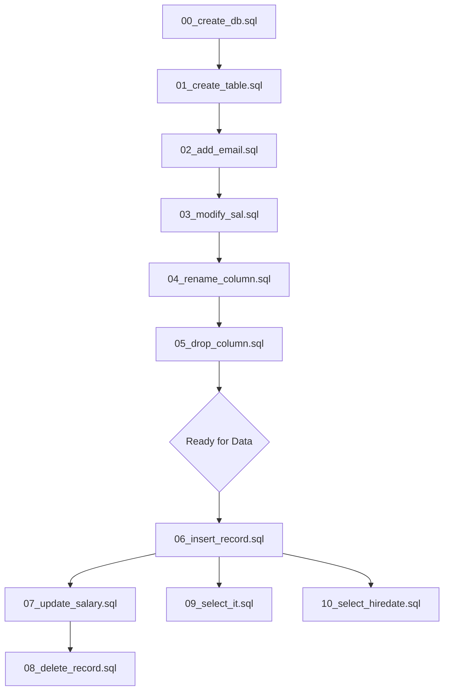

# SQL - Employee Management System

This repository contains a collection of SQL scripts demonstrating fundamental database operations, including Data Definition Language (DDL) and Data Manipulation Language (DML).

## Execution Flow Visualization
To understand how the database structure evolves through these scripts, follow this execution path:

## Final Table Schema
After executing all DDL scripts (00-05), the resulting `Employee_Abhinav` table structure is:

| Column | Type | Constraints |
| :--- | :--- | :--- |
| **Empno** | INT | PRIMARY KEY |
| **Dept** | VARCHAR(100) | |
| **Job** | VARCHAR(100) | |
| **HireDate** | DATE | |
| **Sal** | DECIMAL(10, 2) | Allows NULL |
| **FirstName** | VARCHAR(100) | |
| **LastName** | VARCHAR(100) | |
| **Email** | VARCHAR(255) | |

## Script Descriptions

### Database Initialization
- **[00_create_db.sql](00_create_db.sql)**: Creates the `Employee_Abhinav` database.

### Data Definition Language (DDL)
These scripts modify the structure of the database:
- **[01_create_table.sql](01_create_table.sql)**: Creates the initial `Employee_Abhinav` table with primary keys and basic attributes.
- **[02_add_email.sql](02_add_email.sql)**: Adds an `Email` column to the table.
- **[03_modify_sal.sql](03_modify_sal.sql)**: Modifies the `Sal` column to allow NULL values.
- **[04_rename_column.sql](04_rename_column.sql)**: Renames the `Department` column to `Dept`.
- **[05_drop_column.sql](05_drop_column.sql)**: Removes the `Position` column from the table.

### Data Manipulation Language (DML)
These scripts handle data entry, updates, and queries:
- **[06_insert_record.sql](06_insert_record.sql)**: Inserts a sample employee record.
- **[07_update_salary.sql](07_update_salary.sql)**: Updates the salary for a specific employee.
- **[08_delete_record.sql](08_delete_record.sql)**: Deletes a specific employee record.
- **[09_select_it.sql](09_select_it.sql)**: Queries employees belonging to the 'IT' department.
- **[10_select_hiredate.sql](10_select_hiredate.sql)**: Queries employees hired after a specific date.

## Usage
Scripts are numbered in the order they should typically be executed to set up and interact with the database.
